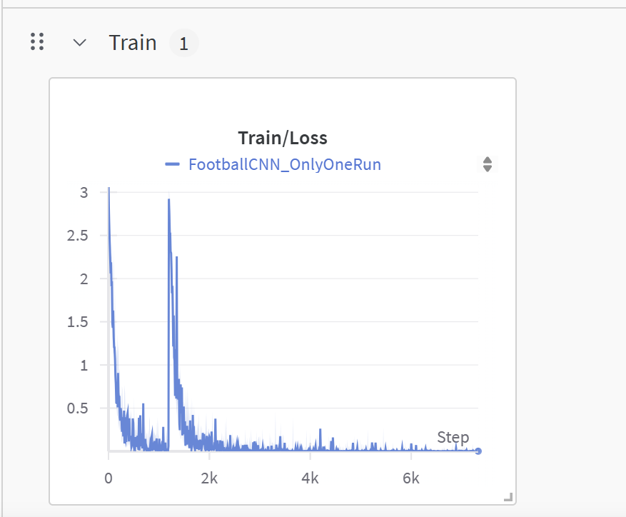
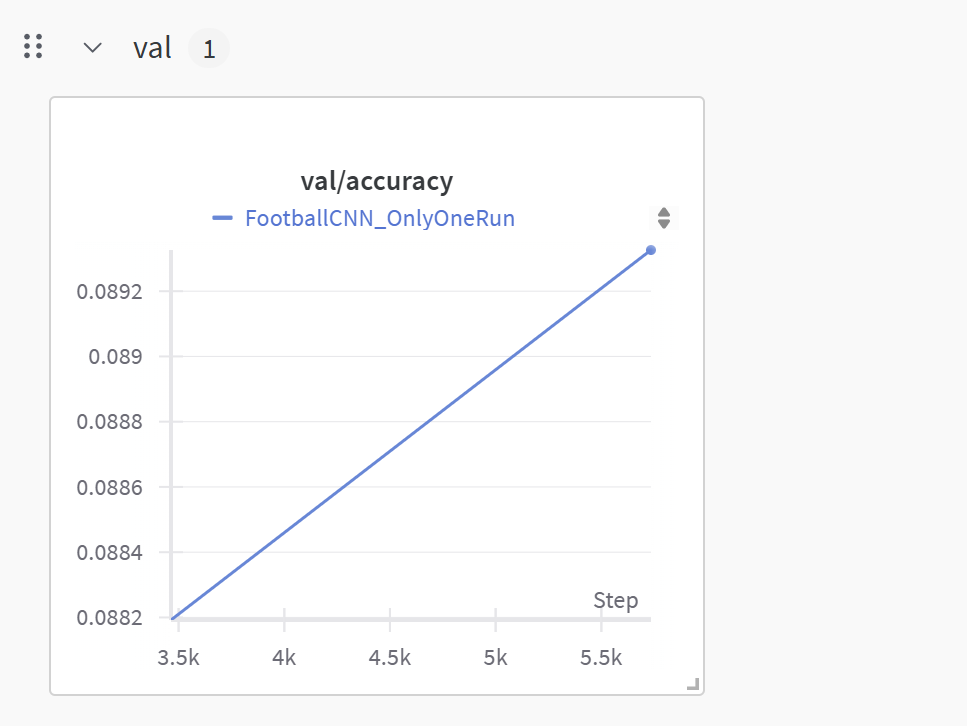

# Model_NN_Animals
# MODEL ANIMALS CNN 

# LIBRARY
    PYTORCH 

    
# TRAIN/LOSS

# VAL/ACC

# STRUCTURE 

    Dataset

**Dataset created by `myself`**

    Model 

**SimpleCNN model made by `myself`**

_It consists of one flatten layer_
_It consists of five fully connected layers_

    Parameters

|STT|Parameters|Value Default|
|---|----------|-------------|
|1|root|Animal_Dataset|
|2|epochs|100|
|3|batch-size|16|
|4|image-size|224|
|5|trained_models|trained_models|
|6|checkpoint|None|
|7|use-wandb|None|

    Note

This is model train animals dataset.
- It include three file :
  + The first file, it have the code to create and restructuring dataset. Name file is Dataset_DUAUO_Animals
  + The second file, it have the code to create model Neural Network. Name file is NN_Model_Animals
  + The end file, it have the code to link two file above and test model. Name file is FullModel_NN_Dataset

`

